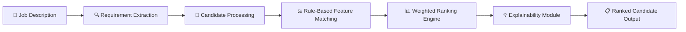
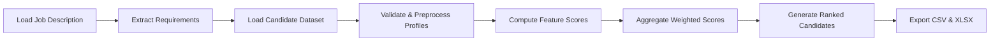

# redrob-candidate-ranking

> An explainable, lightweight, rule-based Intelligent Candidate Ranking System developed for **Redrob Track 1 – Intelligent Candidate Discovery Challenge**.

---

## 📂 Project Structure

```text
redrob-candidate-ranking/
│
├── .gitignore                     # Git ignore rules
├── rank.py                        # Main candidate ranking pipeline
├── README.md                      # Project documentation
├── requirements.txt               # Project requirements
├── submission_metadata.yaml       # Submission metadata
├── validate_submission.py         # Submission validation script
│
├── data/
│   ├── README.md                  # Dataset description
│   ├── sample_candidates.json     # Sample candidate dataset
│   └── sample_submission.csv      # Sample submission format
│
├── docs/
│   ├── methodology.md             # Methodology documentation
│   └── methodology.pdf            # Exported methodology PDF
│
├── outputs/
│   ├── submission.csv             # Final submission file
│   └── ranked_candidates.xlsx     # Ranked candidate output
│
└── tools/
    └── make_methodology_pdf.py    # PDF generation utility
```

---

## 📌 Problem Statement

Traditional Applicant Tracking Systems (ATS) primarily rely on exact keyword matching, which can overlook highly qualified candidates whose profiles use different terminology.

This project addresses that limitation by implementing a rule-based, explainable ranking system that evaluates candidates using multiple structured attributes such as technical skills, experience, education, domain expertise, certifications, and profile completeness. The resulting rankings are transparent, reproducible, and aligned with the job requirements.

---

## ⚙️ Installation

Clone the repository:

```bash
git clone https://github.com/shubhpandey2985-ctrl/redrob-candidate-ranking.git
cd redrob-candidate-ranking
```

Python 3.10 or later is recommended.

No external dependencies are required.

---

## 🏗️ System Architecture



---

## 🔄 End-to-End Workflow



## 🛠️ Technologies

| Technology | Purpose |
|------------|---------|
| Python 3.10+ | Core implementation |
| Python Standard Library | Data processing, scoring, file handling |
| CSV / JSON | Input and output data formats |
| Git & GitHub | Version control and project hosting |
| Markdown | Documentation |

---

## Why This Solution?

- ✅ Lightweight (No external dependencies)
- ✅ Deterministic and reproducible ranking
- ✅ Explainable scoring methodology
- ✅ Easy to maintain and extend
- ✅ Efficient execution on standard CPU hardware
- ✅ Fully compliant with the Redrob Track 1 submission format
